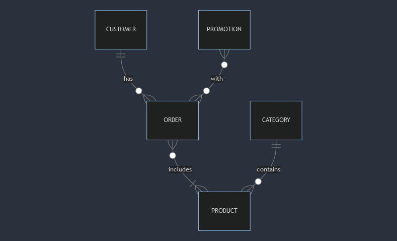

# Project-Promo
Database for promotion campaign

# Design Document

By Sannie Cheung

Video overview: <https://youtu.be/vzInmHUkSGo>

## Scope

The database for product sales includes all entities necessary to facilitate the tracking of promotion activities and the spending behaviours of customers. As such, included in the database's scope is:

* Products, including basic identifying information, category
* Orders, including customers who purchased how many quantities and their corresponding value
* Promotions, including the promotion period, discount value and type
* Categories, including the description

Out of scope are elements like person in charge of the promotion, promotion content, description of product, created time of the customers ids and other non-core attributes.

## Functional Requirements

This database will support:

* Sales team on searching the best-selling products
* Marketing team on tracking the ongoing campaign and the result of past campaigns
* Marketing team on altering the promotion, such as increasing or decreasing the quota

## Representation

### Entities

The entities includes 4 tables, `customers`, `promotions`, `orders`, `products`,  and `categories`.

#### Customers

The `customers` table includes:

* `id`, which specifies the unique ID for the customer, as an `INTEGER`. This column thus has the `PRIMARY KEY` constraint applied.
* `name`, which specifies the name for the customer as `TEXT`.

All columns in the `customers` table are required, and hence should have the `NOT NULL` constraint applied. No other constraints are necessary.

#### Promotions

The `promotions` table includes:

* `id`, which specifies the unique ID for the product, as an `INTEGER`. This column thus has the `PRIMARY KEY` constraint applied.
* `name`, which specifies the name for the promotion campaign as `TEXT`.
* `type`, which specifies the type of discount allocated (eg. OVER: for value over specific amount, BUDDLE: for buddle price...) as `TEXT`
* `discount`, which specifies the discounte value (ie. for value <1 indicating a percentage discount, where for value >=1 indicating a instant cash discount) as `NUMERIC`.
* `valid_start`, which specifies the valid start of the promotion campign as an `TEXT`.
* `valid_end`, which specifies the valid end of the promotion campign as an `TEXT`.
* `quota`, which specifies the quota of the promotion campign as an `INTEGER`.
* `used`, which specifies the number of promotion code used in the promotion campign as an `INTEGER`. The default value for the `used` attribute is 0, as denoted by `DEFAULT 0`.

All columns in the `promotions` table are required, and hence should have the `NOT NULL` constraint applied. No other constraints are necessary.

#### Categories

The `categories` table includes:

* `id`, which specifies the unique ID for the category, as an `INTEGER`. This column thus has the `PRIMARY KEY` constraint applied.
* `name`, which specifies the name for the category as `TEXT`.

All columns in the `categories` table are required, and hence should have the `NOT NULL` constraint applied. No other constraints are necessary.

#### Products

The `products` table includes:

* `id`, which specifies the unique ID for the product, as an `INTEGER`. This column thus has the `PRIMARY KEY` constraint applied.
* `category_id`, which specifies the ID for the category belongs to as `NUMERIC`. This column thus has the `FOREIGN KEY` constraint applied, referencing the `id` column in the `categories` table to ensure data integrity.
* `name`, which specifies the name for the product as `TEXT`.
* `cost`, which specifies the item cost per unit as `NUMERIC`.
* `price`, which specifies the item price per unit as `NUMERIC`.

All columns in the `products` table are required, and hence should have the `NOT NULL` constraint applied. No other constraints are necessary.

#### Orders

The `orders` table includes:

* `id`, which specifies the unique ID for the order, as an `INTEGER`. This column thus has the `PRIMARY KEY` constraint applied.
* `customer_id`, which sepecifies which customer created and own this order, as an `INTEGER`.
* `product_id`, which specifies the product id as an `INTEGER`. This column thus has the `FOREIGN KEY` constraint applied, referencing the `id` column in the `products` table to ensure data integrity.
* `quantity`, which specifies the number of item ordered as an `INTEGER`.
* `item_promo`, which speciies the promotion id that applies to the item(s). This column thus has the `FOREIGN KEY` constraint applied, referencing the `id` column in the `promotions` table to ensure data integrity.
* `total_promo`, which speciies the promotion id that applies to the total order value. This column thus has the `FOREIGN KEY` constraint applied, referencing the `id` column in the `promotions` table to ensure data integrity.
* `created`, which speciies when the order is created as an `NUMERIC`. The default value for the `created` attribute is the current timestamp, as denoted by `DEFAULT CURRENT_TIMESTAMP`.

Except promotional attribute `item_promo`, `total_promo`, all other columns in the `orders` table are required, and hence should have the `NOT NULL` constraint applied. No other constraints are necessary.

### Relationships

The below entity relationship diagram describes the relationships among the entities in the database.

As detailed by the diagram:

* One customer is capable to have zero or many oreder made.
* On the other side, one order is associated only one customer.
* In one order, it includes one or many products (e.g. banna and apple).
* Meanwhile, one order is associated with zero or many promotion (e.g. promotion allocated to the total value and promotinon allocated to item, or 0 promotion is applied to single order).
* In a category, it includes zero or many products. Taking note that a newly created category can be associated with 0 product. On the flip side, a product is associated with only one category.

## Optimizations

Per the typical queries in `queries.sql`, it is common for users of the database to access all the items in an order with specified customer ID. For that reason, indexes are created on the `id` column in the `customers` table to speed the identification of specific customers.

Similarly, it is also common practice for a user of the database to concerned with best-selling products. As such, an index is created on the `id`, and `name` columns in the `products` table to speed the identification of problems by name.

Furthermore, it is also common practice for a user of the database to serach for the details of a promotion campign. Therefore, indexes are created on the `id`, `name`, `valid_start`, `valid_end`, `quota`, and `used` columns in the `promotions` table to speed the search of promotion campaign.

## Limitations

The current design assume that multiple items are included in one order by separate entry. This take extra effort to summarizing the order details and to calculate its corresponding total value. Assuming there is only one item promotion code for each product within the same order, even if it may be applicable for >= 1 discount based on the quantity. Assuming there is only one total promotion for each order.
